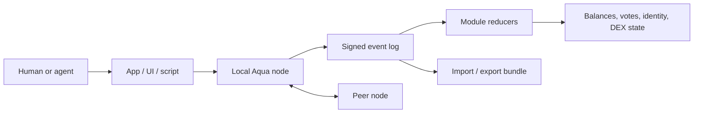

# Project Aqua Documentation

This folder explains Project Aqua for different kinds of readers.

## New To Aqua

Start here:

1. [Plain English Protocol Guide](protocol-guide.md)
2. [Protocol Glossary](protocol-glossary.md)

These explain what Aqua is, why events matter, and how the major pieces fit together.

## Implementing The Protocol

Read:

1. [Event Format](event-format.md)
2. [Module Rules](modules.md)
3. [Build Apps and Agents](build-apps-and-agents.md)

These explain the rules another implementation needs to follow.

## Running A Node

Read:

1. [Runbook](runbook.md)
2. [Node API](node-api.md)

These explain how to run local nodes, connect peers, use the browser UI, and call the HTTP API.

## One-Screen Summary

The durable object is the signed event log. Apps, nodes, and modules are ways of creating, sharing, and interpreting it.

## Core Promise

Anyone should be able to:

- read the rules
- run a node
- create events
- sync with peers
- export memory
- import memory
- fork when needed
- build another compatible interface

No central company is required for the protocol to make sense.
